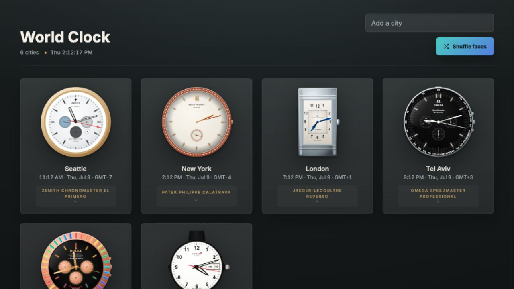

# World Clock

[](https://github.com/christopherrbrown3/world-clock/actions/workflows/ci.yml)

World Clock is a standalone HTML/SVG gallery of detailed watch and clock faces. It runs directly in the browser, with no build step and no server required.

[Live demo](https://christopherrbrown3.github.io/world-clock/)



## Features

- 60+ watch and clock faces rendered with inline SVG.
- Live analog, digital, date, day/date, GMT, and complication behavior.
- Reference-driven visual details for iconic clocks and watches.
- Offline-friendly: open the HTML file directly in a browser.
- Lightweight validation through GitHub Actions.

## Open Locally

```sh
open index.html
```

Use `index.html` to choose between the active build and model-version pages. Open `world-clock.html` directly when working on the active version.

## Model Versions

The project keeps AI-model versions as separate standalone HTML pages under `versions/`. The current model checkpoint can be refreshed while that model is active; finalized model versions should be treated as immutable.

- Active build: [world-clock.html](world-clock.html)
- Codex 5.5 checkpoint: [versions/codex-5.5.html](versions/codex-5.5.html)
- Claude Opus 4.8 snapshot: [versions/claude-opus-4.8.html](versions/claude-opus-4.8.html)

See [docs/model-versioning.md](docs/model-versioning.md) for the model-version workflow and the future Codex 5.6 plan.

Future AI model runs and contributors should read [docs/model-and-contributor-guide.md](docs/model-and-contributor-guide.md) before changing watch faces or creating new model pages.

## Validate

```sh
npm test
```

The validation checks the active build, model-version pages, and version manifest for JavaScript syntax errors, unresolved merge conflicts, missing links, and required watch-face keys.

## Development Workflow

Use a branch for every meaningful change:

```sh
git switch -c short-description
# edit files
npm test
git add .
git commit -m "Describe the change"
git push -u origin short-description
gh pr create --fill
```

See [docs/github-workflow.md](docs/github-workflow.md) for the project workflow and GitHub concepts.

## Release Readiness

Use [docs/public-release-checklist.md](docs/public-release-checklist.md) before major visibility or release changes.

## License And Notices

The original source code and documentation are released under the [MIT License](LICENSE).

This is an independent project. Brand, product, clock, watch, and character names are used descriptively for reference and identification. See [NOTICE.md](NOTICE.md).
