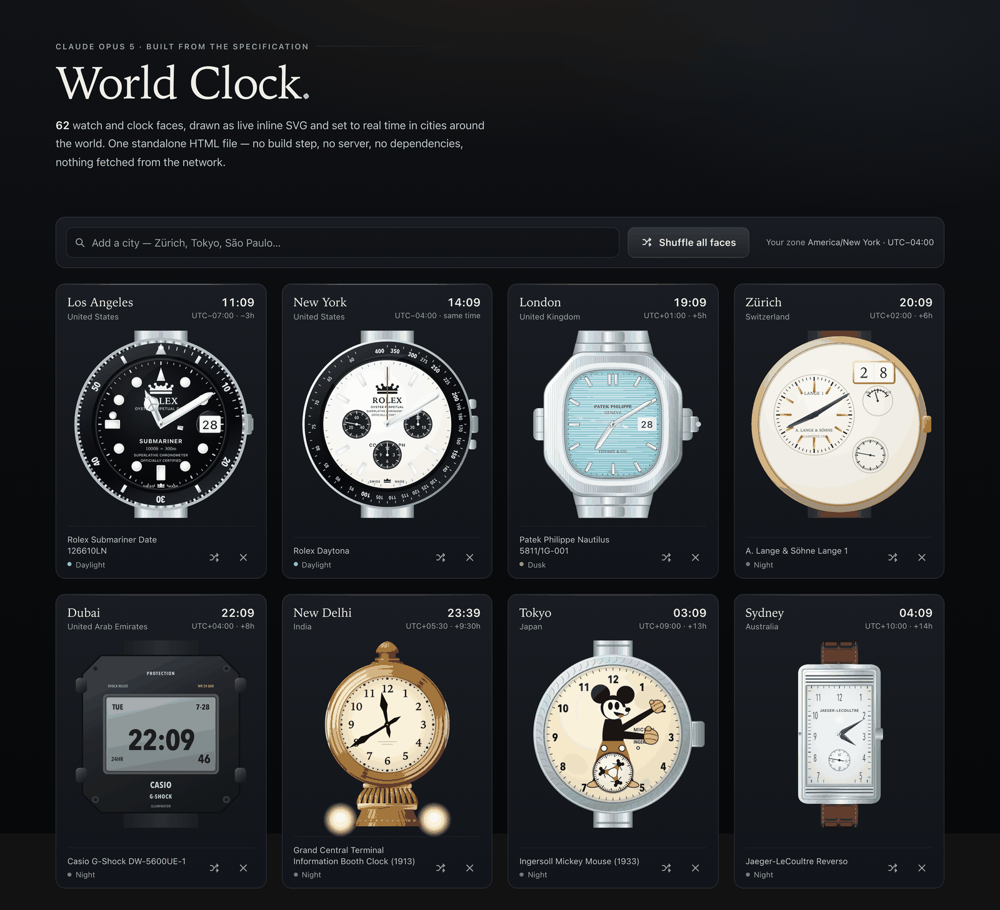
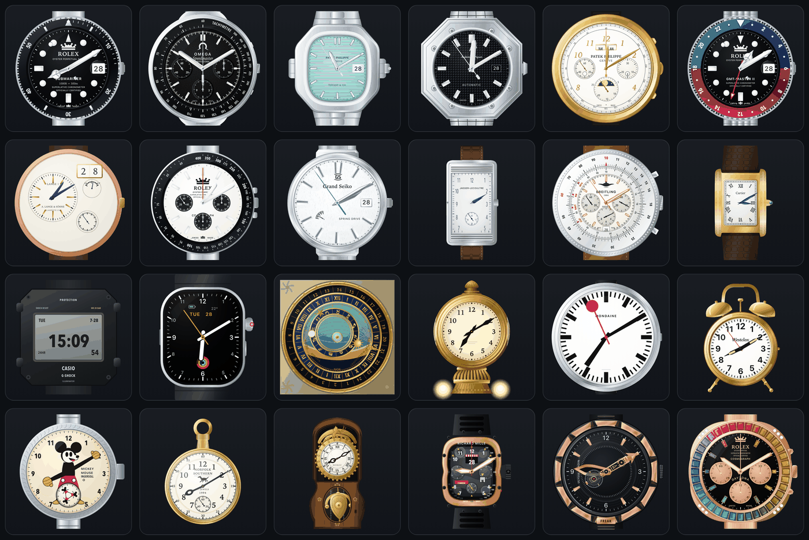
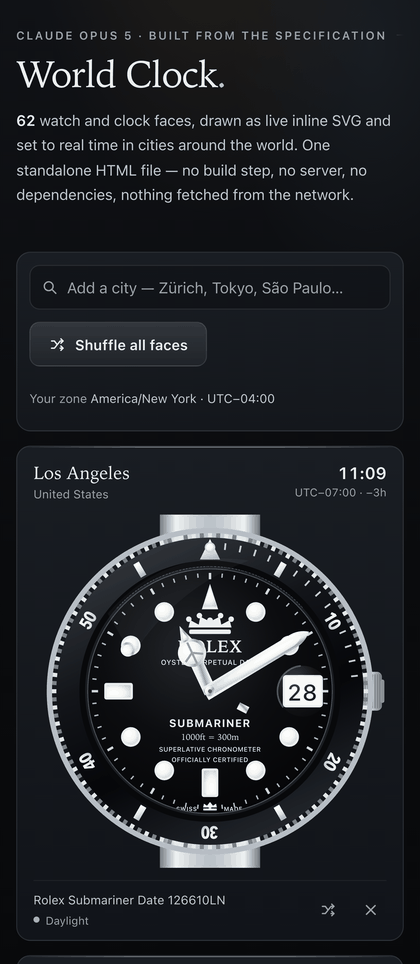

<div align="center">

# World Clock

**A world clock that renders 62 iconic watch and clock faces as live inline SVG.**<br>
One standalone HTML file — no build step, no server, no dependencies, nothing fetched from the network.

[](https://github.com/christopherrbrown3/world-clock/actions/workflows/ci.yml)
[](https://christopherrbrown3.github.io/world-clock/)
[](docs/watch-face-catalog.md)
[](package.json)
[](LICENSE)

**[Open the live demo →](https://christopherrbrown3.github.io/world-clock/)**

</div>



## What this is

A functional world clock, and a study in how far inline SVG can be pushed. Every face is drawn
from reference photographs of the real object — case shape, dial texture, marker geometry, hand
form, printed text, and complications — then rendered live against the browser clock. There are
no raster images, no sprites, and no server rendering anywhere in the project.

Each page in this repository is a single self-contained `.html` file. Save one to disk, open it
offline, and it still keeps time.

## The catalog

Sixty-two objects, spanning dive watches, chronographs, dress watches, integrated-bracelet sports
watches, digital LCDs, a smartwatch, station and terminal clocks, an astronomical clock, a
longcase clock, an alarm clock, a pocket watch, and a character watch.



Objects that are not round wristwatches are not drawn as round wristwatches. Big Ben, the Grand
Central information booth clock, the Prague astronomical clock, the Comtoise longcase, the
Westclox twin bell and the Norfolk Southern pocket watch each keep their real proportions.

See **[docs/watch-face-catalog.md](docs/watch-face-catalog.md)** for the full validated list.

## Features

| | |
|---|---|
| **62 faces** | Rendered as inline SVG, drawn from reference photographs |
| **Correct local time** | Zones resolved through `Intl` and the IANA database, so DST is always current |
| **Live complications** | Date, day/date, GMT, digital, moonphase, subdials, power reserve, regatta countdown |
| **Movement-accurate motion** | Sweep, quartz tick, Spring Drive glide, and the Mondaine stop2go 58-second pause |
| **City management** | Add and remove cities from 130+ locations, with keyboard-accessible search |
| **Shuffle** | Reshuffle every face, or any single face, without repeating a face |
| **Automatic ordering** | Cities sort west to east by current UTC offset, and re-sort as offsets change |
| **Offline first** | Works from `file://`, GitHub Pages, or any static server |
| **Accessible** | WCAG AA contrast, ≥44px targets, visible focus, `prefers-reduced-motion` honored |

<div align="center">

<p><em>Responsive down to phone width, with no horizontal overflow.</em></p>
</div>

## Quick start

No install, no build, no toolchain:

```sh
git clone https://github.com/christopherrbrown3/world-clock.git
cd world-clock
open index.html
```

`index.html` is a version picker. Open `world-clock.html` directly to use the active build.

## Repository layout

```
world-clock.html            active working build
index.html                  version picker (also the GitHub Pages entry point)
versions/                   standalone model checkpoints, each self-contained
docs/                       contributor, versioning, workflow and release guides
scripts/validate.js         dependency-free validation used by CI
```

## Model versions

This project doubles as a benchmark of AI-model output. Each model's work is preserved as its own
standalone page and frozen once that model's cycle ends, so results can be compared side by side.

| Version | Page | Snapshot | State |
|---|---|---|---|
| Active build | [world-clock.html](world-clock.html) | — | In development |
| Codex 5.6 Sol | [versions/codex-5.6-sol.html](versions/codex-5.6-sol.html) | 2026-07-28 | Current checkpoint |
| Claude Opus 5 | [versions/claude-opus-5.html](versions/claude-opus-5.html) | 2026-07-28 | Frozen |
| Claude Fable 5 | [versions/fable-5.html](versions/fable-5.html) | 2026-07-17 | Frozen |
| Codex 5.6 Terra | [versions/codex-5.6.html](versions/codex-5.6.html) | 2026-07-09 | Frozen |
| Codex 5.5 | [versions/codex-5.5.html](versions/codex-5.5.html) | 2026-07-09 | Frozen |
| Claude Opus 4.8 | [versions/claude-opus-4.8.html](versions/claude-opus-4.8.html) | 2026-06-30 | Frozen |

A model may either improve an existing page or write a new one from scratch. See
**[docs/model-versioning.md](docs/model-versioning.md)** for the workflow.

## Validation

```sh
npm test
```

Runs `scripts/validate.js`, which has no dependencies of its own. It parses every inline script,
checks for merge-conflict markers and required document structure, verifies the version manifest
against the files on disk, confirms the required face keys are present on every app page, checks
that the watch-face catalog matches the faces the active build actually exposes, and resolves every
relative link in the Markdown. The same check runs in CI on every push and pull request.

## Contributing

Faces are judged against reference photographs, not from memory — a face is not finished until it
has been compared to the real object at high zoom, and checked at several times of day for hand
collisions, aperture overflow, and single- versus double-digit dates.

- **[CONTRIBUTING.md](CONTRIBUTING.md)** — contributor expectations
- **[docs/model-and-contributor-guide.md](docs/model-and-contributor-guide.md)** — fidelity standards, SVG guidance, QA checklists
- **[docs/github-workflow.md](docs/github-workflow.md)** — branch, PR, CI and merge flow
- **[docs/public-release-checklist.md](docs/public-release-checklist.md)** — checks before a visibility or release change
- **[docs/README.md](docs/README.md)** — full documentation index

Every meaningful change goes through a branch and a pull request.

## License and notices

Source code and documentation are released under the [MIT License](LICENSE).

This is an independent, non-commercial project. Brand, product, clock, watch and character names
are used descriptively, to identify the objects depicted. No affiliation with or endorsement by any
manufacturer is claimed or implied. See [NOTICE.md](NOTICE.md).
