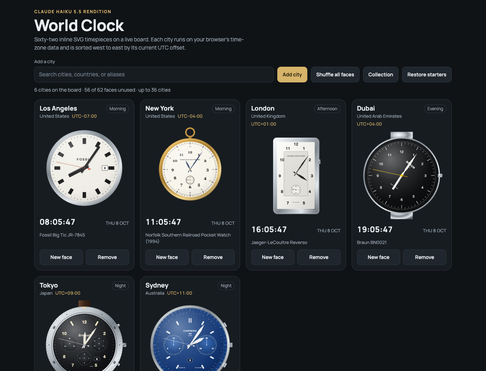
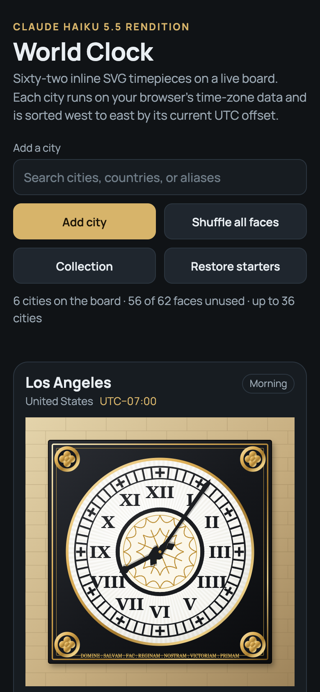
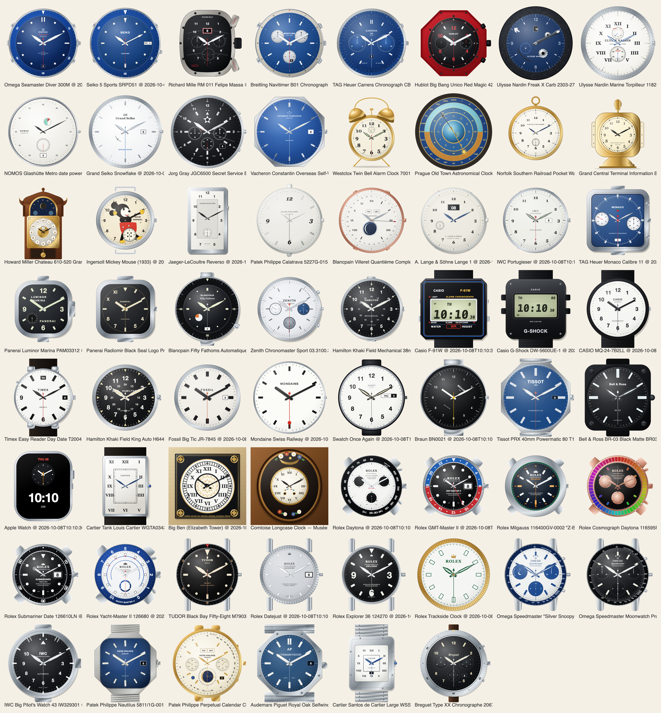

# Claude Haiku 5.5 Reference Notes

This note records how the from-scratch Claude Haiku 5.5 rendition ([`versions/claude-haiku-5.5.html`](../versions/claude-haiku-5.5.html)) was researched and built: the reference basis for each of the 62 faces, the variant choices, the intentional approximations, and the validation that was run. The page has its own interface, time engine, and SVG drawing helpers, and it was not built from another model’s page.

## Screenshots

## Reference coverage

- 35 faces were checked against maintainer-supplied photograph bins, with 4 to 20 photographs per face.
- 27 faces had empty bins. Their references came from public sources retrieved during authoring, mostly Wikimedia Commons photographs and Wikipedia articles, listed at the end of this note. Several brand and retailer pages were unavailable, and some Commons lookups were rate-limited.
- Lange 1 and Portugieser had no usable dial photograph. Their dials come from general knowledge of the references and are the first faces to re-check against photographs.
- Railroad Pocket Watch had no photograph and follows public descriptions of a railroad-style open-face dial.

## Variant choices

- **Patek Philippe Nautilus 5811/1G-001** is drawn as the white-gold reference named in the catalog, from published descriptions, because no photograph of that reference was available. The maintainer photographs show the steel Tiffany-dial variant, which is not used.
- **Rolex Milgauss 116400GV Z-Blue** is drawn with a blue-black dial, because some sources describe the dial as black.
- **IWC Big Pilot’s Watch 43** is the 43 mm no-date variant, as in the photographs.
- **Grand Central information booth clock** uses Arabic numerals, as in the photographs.
- **Big Ben** uses black hands, as in the photographs.

## Intentional approximations

- **Micro-typography.** Small dial text, logos, and engraved details are simplified so that the faces stay legible at page sizes.
- **Bracelets.** Bracelets are not drawn for several faces, including the Seamaster 300M, Overseas, and Khaki Field.
- **Static indicators.** Chronograph counters rest at their zero or starting positions and do not track elapsed time. Power-reserve indicators on the Nomos Metro and Grand Seiko Snowflake are static.
- **Moon phase.** Moon faces compute the phase from the browser clock with a mean synodic month, so they are approximate near the exact instants of new and full moon.
- **Digital faces.** Live readouts use a font, not segment LCDs. The F-91W uses monospace digits rather than seven segments.
- **Orloj.** The astronomical clock omits its statues and the Arabic 1–24 ring, and its moon hand follows the lunar-age role rather than the clock’s own motion.

## Validation

- `npm test` passes with the page listed in `versions.json`.
- Faces were rendered with the page’s own drawing kit at representative times (10:10:30, 12:00:00, 03:15:00, 06:30:00, and 23:59:30) and checked for console errors. A contact sheet of all 62 faces at 10:10:30 was reviewed as a set.
- Date faces were checked at single- and double-digit dates and at a month end.
- Browser checks in headless Chrome covered the starter board, west-to-east sorting by UTC offset, city search by keyboard and mouse, duplicate and unknown-city handling, removing a city, per-clock and shuffle-all face changes without duplicates, the inspection and collection dialogs, persistence across reload, and a 390 px layout without horizontal overflow.
- A full 36-city board held a steady frame rate in headless Chrome, averaging 16.7 ms per frame.

## Faces

| Face | Key | Reference basis | Notes |
| --- | --- | --- | --- |
| Rolex Submariner Date 126610LN | `submariner` | Maintainer photographs (10) | — |
| Omega Speedmaster Moonwatch Professional 310.30.42.50.01.001 | `speedmaster` | Maintainer photographs (11) | — |
| Patek Philippe Nautilus 5811/1G-001 | `nautilus` | Published descriptions of the 5811/1G-001; maintainer photographs (8) for proportions only | Case size approximate; the bin photographs show a steel Tiffany-dial variant, which is not used. |
| Audemars Piguet Royal Oak Selfwinding 15510ST.OO.1320ST.06 | `royaloak` | Maintainer photographs (9) | — |
| Patek Philippe Calatrava 5227G-015 | `calatrava` | Commons: Patek Philippe Calatrava ref. 96 photograph | Dial inferred from a 1930s ref. 96 photograph; numerals and seconds unverified. |
| Cartier Tank Louis Cartier WGTA0342 | `tank` | Commons: Cartier Tank photographs | No guilloché; Breguet hands simplified; generic white-gold metal. |
| Jaeger-LeCoultre Reverso | `reverso` | Commons: Jaeger-LeCoultre Reverso photograph | One photograph only; numerals and guilloché approximated. |
| Omega Seamaster Diver 300M | `seamaster` | Maintainer photographs (11) | No bracelet; lugs and hands simplified. |
| A. Lange & Söhne Lange 1 | `lange1` | No usable dial photograph found | Date window, subdial, and numerals drawn from general knowledge. |
| IWC Portugieser | `portugieser` | No usable dial photograph found | Numerals and date window drawn from general knowledge. |
| Rolex Daytona | `daytona` | Maintainer photographs (12) | Chronograph counters rest at zero. |
| Rolex GMT-Master II | `gmt` | Maintainer photographs (9) | — |
| Rolex Datejust | `datejust` | Maintainer photographs (10) | — |
| Grand Seiko Snowflake | `snowflake` | Maintainer photographs (8) | Power-reserve indicator static; dial texture approximated. |
| Casio G-Shock DW-5600UE-1 | `gshock` | Wikipedia: G-Shock; Commons: G-Shock GW-M5610 photograph | DW-5600 details inferred from a GW-M5610 photograph. |
| Casio F-91W | `f91w` | Wikipedia: Casio F-91W | Monospace digits rather than seven-segment LCD. |
| Apple Watch | `apple` | Commons: Apple Watch photographs | Photographs show screens off, so the hybrid layout is generic. |
| Swatch Once Again | `swatch` | No source recorded during authoring | Lug shape approximate. |
| Braun BN0021 | `braun` | Commons: Braun AW10 photograph | Built from the AW10 photograph; yellow seconds and "Made in Germany" assumed from it. |
| Mondaine Swiss Railway | `mondaine` | No source recorded during authoring | Logo placed approximately. |
| TAG Heuer Monaco Calibre 11 | `monaco` | Commons: TAG Heuer Monaco 40th anniversary photograph and two further photographs | Crown side and counter layout inferred from several photographs. |
| Panerai Luminor Marina PAM03312 | `panerai` | Commons: Panerai Luminor and Marina Militare photographs | Rounded-square case rather than a true cushion profile. |
| Rolex Trackside Clock | `f1` | Maintainer photographs (5) | — |
| Big Ben (Elizabeth Tower) | `bigben` | Commons: Elizabeth Tower clock face photographs | Fleurons and corner lions simplified; hands black, as in the photographs. |
| Seiko 5 Sports SRPD51 | `seiko5` | Maintainer photographs (20) | Knurled flank and the "5" emblem simplified. |
| Blancpain Villeret Quantième Complet | `moonphase` | Commons: Blancpain MG 2607 photograph | Brand and numeral placement approximate. |
| Richard Mille RM 011 Felipe Massa | `richardmille` | Maintainer photographs (15) | Case less barrel-curved than the real tonneau; skeleton movement suggested rather than detailed. |
| TUDOR Black Bay Fifty-Eight M79030N | `blackbay58` | Maintainer photographs (8) | — |
| Breitling Navitimer B01 Chronograph 43 | `navitimer` | Maintainer photographs (12) | Slide-rule bezel reduced to numerals and ticks. |
| Zenith Chronomaster Sport 03.3100.3600/69.M3100 | `elprimero` | Commons: Zenith Chronomaster open photograph | One rose-gold photograph; steel Sport layout inferred. |
| Vacheron Constantin Overseas Self-Winding 4520V/210A-B128 | `overseas` | Maintainer photographs (4) | Octagonal case simplified; no bracelet; silver batons instead of lume. |
| Hublot Big Bang Unico Red Magic 42 | `bigbang` | Maintainer photographs (6) | No Red Magic photograph; case and dial follow published descriptions; lugs omitted. |
| Tissot PRX 40mm Powermatic 80 T137.407.11.041.00 | `prx` | Commons: Tissot PRX photograph | Blue dial from general knowledge rather than a matching photograph; octagonal case approximate. |
| Hamilton Khaki Field Mechanical 38mm H69439931 | `khaki` | Commons: Hamilton Khaki Field Mechanical photograph | 24-hour ring from a bracelet photograph; bracelet not drawn. |
| Bell & Ross BR-03 Black Matte BR03A-BL-CE/SRB | `br03` | Commons: Bell & Ross photograph; Bell & Ross BR 01 photograph for styling | No BR 03 photograph; styling from a BR 01 photograph. |
| Westclox Twin Bell Alarm Clock 70010A | `twinbell` | Maintainer photographs (7) | Bell and handle shapes simplified. |
| Comtoise Longcase Clock — Musée du Temps, c. 1850 | `grandfather` | Commons: Comtoise dial photograph | Hood a plain oval rather than the shaped bonnet; florals stylised; no maker signature. |
| Prague Old Town Astronomical Clock (2018-restored astrolabe) | `orloj` | Maintainer photographs (12) | No statues or Arabic 1–24 ring; simplified night band; moon hand follows the lunar-age role rather than the clock’s own motion. |
| Ulysse Nardin Marine Torpilleur 1182-310/42 | `marine` | Maintainer photographs (10) | White Torpilleur variant assumed; lume dots approximate. |
| Ulysse Nardin Freak X Carb 2303-270/CARB | `freak` | Maintainer photographs (9) | Hour disc shown as a stylised window reading; carbon bezel simplified. |
| Patek Philippe Perpetual Calendar Chronograph 5270J-001 | `patek` | Maintainer photographs (8) | — |
| Rolex Explorer 36 124270 | `explorer` | Maintainer photographs (9) | — |
| Cartier Santos de Cartier Large WSSA0018 | `santos` | Maintainer photographs (9) | Rounded-rectangle case instead of the curved lug profile. |
| IWC Big Pilot's Watch 43 IW329301 | `bigpilot` | Maintainer photographs (12) | The 43 mm no-date variant, as in the photographs. |
| Blancpain Fifty Fathoms Automatique 5015 1130 71S | `fiftyfathoms` | Commons: Blancpain photograph | Lugs and bezel simplified. |
| Breguet Type XX Chronographe 2067 2067ST/92/3WU | `typexx` | Maintainer photographs (7) | — |
| Panerai Radiomir Black Seal Logo PAM00754 | `radiomir` | Commons: Marina Militare 1936 and Radiomir California photographs | Dial from 1936 and California photographs; Black Seal lettering and seconds unverified. |
| TAG Heuer Carrera Chronograph CBN2011.BA0642 | `carrera` | Maintainer photographs (9) | Tachymeter numerals omitted. |
| Omega Speedmaster "Silver Snoopy Award" 50th Anniversary 310.32.42.50.02.001 | `snoopy` | Maintainer photographs (7) | Stylised Snoopy badge instead of the Peanuts artwork. |
| Rolex Milgauss 116400GV-0002 "Z-Blue" | `milgauss` | Maintainer photographs (9) | Z-Blue dial rendered blue-black, because some sources describe the dial as black. |
| Rolex Yacht-Master II 126680 | `yachtmaster2` | Maintainer photographs (8) | — |
| Jorg Gray JGC6500 Secret Service Edition | `jorggray` | Maintainer photographs (5) | Chronograph counters rest at zero; 12-hour labels inferred. |
| Rolex Cosmograph Daytona 116595RBOW-0001 | `rainbow` | Maintainer photographs (10) | Chronograph counters rest at zero. |
| Norfolk Southern Railroad Pocket Watch (1994) | `railroad` | Wikipedia: Railroad watch | No usable photograph; follows public descriptions. |
| NOMOS Glashütte Metro date power reserve 1101 | `nomosmetro` | Maintainer photographs (9) | Power-reserve disc static. |
| Grand Central Terminal Information Booth Clock (1913) | `grandcentral` | Maintainer photographs (8) | Side faces flat; hands simpler than the photographs; Arabic numerals, as in the photographs. |
| Howard Miller Chateau 610-520 Grandfather Clock | `howardmiller` | Maintainer photographs (7) | Hood less ornate than the photograph. |
| Ingersoll Mickey Mouse (1933) | `mickey` | Maintainer photographs (9) | Arms straight; figure simplified. |
| Hamilton Khaki Field King Auto H64455533 | `kingkhaki` | Commons: Hamilton Khaki Field family photograph | Built from a Khaki Field family photograph; King dial unverified. |
| CASIO MQ-24-7B2LL | `casiomq24` | No source recorded during authoring | White dial chosen from the model suffix; unverified. |
| Fossil Big Tic JR-7845 | `bigtic` | No source recorded during authoring | No photograph; design unverified. |
| Timex Easy Reader Day Date T20041 (INDIGLO) | `timexindiglo` | No source recorded during authoring | No Easy Reader photograph; dial layout and colours assumed. |

"—" means no face-specific gap was recorded. Every face is simplified at the level of micro-detail.

## Sources for faces without bin photographs

- [Patek Philippe Calatrava ref. 96 (Commons)](https://commons.wikimedia.org/wiki/File:Patek_Philippe_Calatrava_ref._96,_fine_anni_Trenta.jpg)
- [Jaeger-LeCoultre Reverso (Commons)](https://commons.wikimedia.org/wiki/File:Jaeger-LeCoultre-Reverso.jpg)
- [Blancpain MG 2607 (Commons)](https://commons.wikimedia.org/wiki/File:Blancpain_MG_2607.jpg)
- [TAG Heuer Monaco 40th anniversary re-edition (Commons)](https://commons.wikimedia.org/wiki/File:TAG_Heuer_Monaco_40th_Anniversary_re-edition.JPG)
- [Zenith Chronomaster open (Commons)](https://commons.wikimedia.org/wiki/File:Zenith_El_Primero_Chronomaster_Open.jpg)
- [Hamilton Khaki Field Mechanical (Commons)](https://commons.wikimedia.org/wiki/File:Hamilton_Khaki_Field_Mechanical_39.jpg)
- [Apple Watch Series 7 (Commons)](https://commons.wikimedia.org/wiki/File:Apple_Watch_Series_7;_January_2022_(01).jpg)
- [Braun AW10 (Commons)](https://commons.wikimedia.org/wiki/File:AW10_-_Braun_-_01.jpg)
- [Tissot PRX (Commons)](https://commons.wikimedia.org/wiki/File:Tissot_watch_PRX_collection_23_January_2025_Philippines1.jpg)
- [Bell & Ross photograph (Commons)](https://commons.wikimedia.org/wiki/File:Bell-and-Ross_MG_2644.jpg)
- [Cartier Tank (Commons)](https://commons.wikimedia.org/wiki/File:Cartier_Tank.jpg)
- [Elizabeth Tower clock face (Commons)](https://commons.wikimedia.org/wiki/File:London_Big_Ben_Inner_Clock_Face_1070925-PSD.jpg)
- [Comtoise dial (Commons)](https://commons.wikimedia.org/wiki/File:Horloge_Comtoise_A_-_Cadran.jpg)
- [Marina Militare 1936 watch (Commons)](https://commons.wikimedia.org/wiki/File:Marina_Militare_1936_watch.jpg)
- [Radiomir California (Commons)](https://commons.wikimedia.org/wiki/File:Radiomircalifornia.jpg)
- [Railroad watch (Wikipedia)](https://en.wikipedia.org/wiki/Railroad_watch)
- [Casio F-91W (Wikipedia)](https://en.wikipedia.org/wiki/Casio_F-91W)
- [G-Shock (Wikipedia)](https://en.wikipedia.org/wiki/G-Shock)
