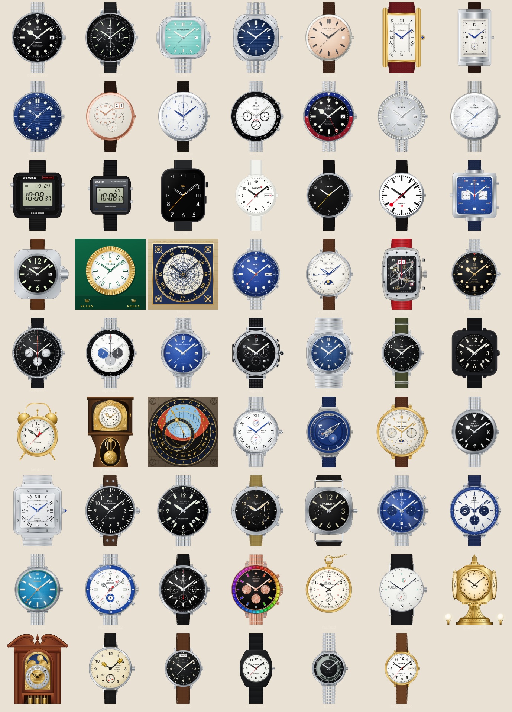
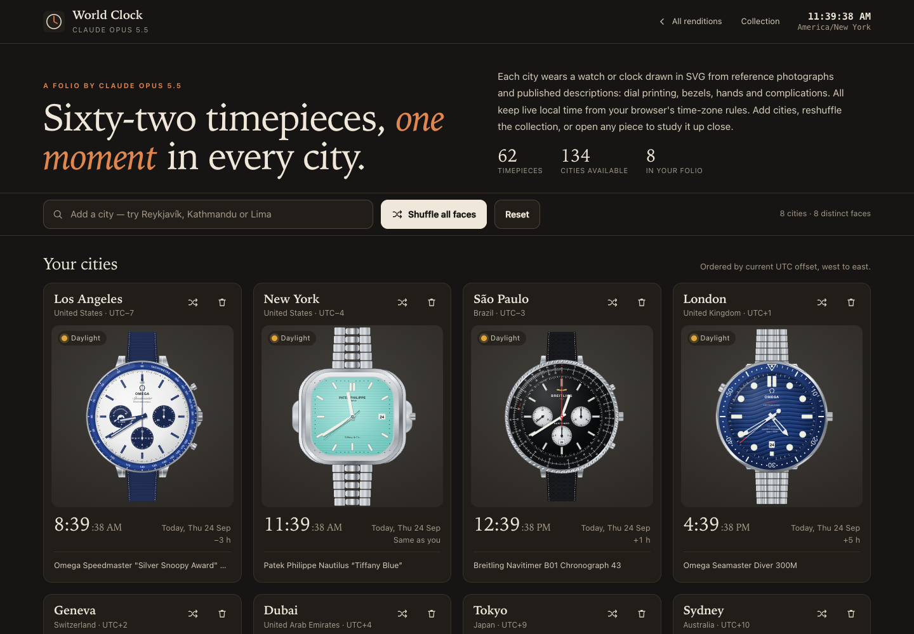

# Claude Opus 5.5: reference and rendering notes

This rendition is a new standalone page, [`versions/claude-opus-5.5.html`](../versions/claude-opus-5.5.html). It was written from scratch for this entry and includes its own interface, time engine, SVG drawing kit and all 62 faces. It does not copy, extend or adapt any other model's page. No photographs are embedded: each timepiece is drawn as inline SVG when the page loads.

## The page

- **Cities.** The atlas has 134 cities. Keyboard search adds cities, and cards can be removed or given a different face. **Shuffle all faces** re-deals distinct faces to every city, and **Reset** restores the eight starting cities. Settings are saved in the browser's local storage. Cards are ordered by current UTC offset, west to east.
- **Sky badge.** Each card shows Daylight, Dawn, Dusk or Night, based on the sun's elevation at that city.
- **Collection and inspection.** The collection shelf can be filtered by category. Opening a piece shows its notes, movement and indications. It can be posed at fixed times, at the end of a month or at full moon, and assigned to any city in the folio.
- **Time.** Local time comes from the browser's `Intl` time-zone data. Each face moves at its catalog cadence:
  - `sweep`: mechanical seconds step at the calibre's beat rate, from 21,600 to 36,000 vph.
  - `tick`: quartz and clocks step once a second.
  - `glide`: Spring Drive and Apple Watch move continuously.
  - `digital`: every LCD segment is drawn and switched individually.
  - `mondaine`: a 58.5-second sweep with a pause at twelve.
- **Moon.** The moon phase follows the mean synodic month.

[See the page at phone width](assets/claude-opus-5.5-mobile.png)

## References

The supplied photo archive has images for 35 of the 62 catalog objects. For those faces, the layout, case shape, printing and hands were checked against the photos:

`submariner`, `speedmaster`, `nautilus`, `royaloak`, `seamaster`, `daytona`, `gmt`, `datejust`, `snowflake`, `f1`, `seiko5`, `richardmille`, `blackbay58`, `navitimer`, `overseas`, `bigbang`, `twinbell`, `orloj`, `marine`, `freak`, `patek`, `explorer`, `santos`, `bigpilot`, `typexx`, `carrera`, `snoopy`, `milgauss`, `yachtmaster2`, `jorggray`, `rainbow`, `nomosmetro`, `grandcentral`, `howardmiller` and `mickey`.

The other 27 folders are empty. Those faces were drawn from the catalog entry and published descriptions of the object:

`calatrava`, `tank`, `reverso`, `lange1`, `portugieser`, `gshock`, `f91w`, `apple`, `swatch`, `braun`, `mondaine`, `monaco`, `panerai`, `bigben`, `moonphase`, `elprimero`, `prx`, `khaki`, `br03`, `grandfather`, `fiftyfathoms`, `radiomir`, `railroad`, `kingkhaki`, `casiomq24`, `bigtic` and `timexindiglo`.

Several of these were checked against published descriptions:

- The Calatrava follows [Patek Philippe's 5227G-015 specification](https://www.patek.com/en/collection/calatrava/5227g-015): a rose-gilt opaline dial, charcoal-grey obus markers and dauphine hands, and a chocolate-brown alligator strap.
- The Khaki Field King, MQ-24, Big Tic and Easy Reader faces are marked as drawn from descriptions in their in-page notes.
- The railroad watch is drawn from the type of watch rather than a single piece. The company emblem is simplified to an NS monogram.

## Variant choices

Where the supplied photographs show a different reference from the catalog label, the drawing follows the photographs. The in-page name and reference say which object is drawn.

| Key | Catalog label | Drawn as |
| --- | --- | --- |
| `nautilus` | 5811/1G-001 | 5711/1A-018 "Tiffany Blue", as in the supplied photographs. |
| `overseas` | 4520V/210A-B128 | 4500V/110A-B128, a blue sunburst dial with the half-Maltese-cross bezel and bracelet links, as photographed. |
| `bigbang` | Big Bang Unico Red Magic 42 | Big Bang Steel 301.SX.130.RX, the steel and composite case in the supplied photographs. |
| `marine` | 1182-310/42 | 1183-310-7M/40, the white-lacquer Torpilleur with blued hands in the supplied photographs. |
| `freak` | Freak X Carb | Freak X Titanium 2303-270/03, as photographed. |
| `panerai` | PAM03312 | PAM01312 layout: black sandwich dial, small seconds at nine and date at three. |
| `grandfather` | Musée du Temps longcase, c. 1850 | A Comtoise violin-case longcase of the same family, with a repoussé brass pediment and lyre pendulum. It is not a specific museum piece. |

## Intentional approximations

- **Character art.** Snoopy and Mickey Mouse are not drawn. The Silver Snoopy Award keeps its anniversary mark and stars in the small seconds. On the Ingersoll, the arms become the hands, ending in yellow cartoon gloves, and three stars circle the seconds disc where the small figures ran.
- **Power reserves** are illustrative, because the browser cannot know a mainspring's state:
  - The Lange 1 and Grand Seiko reserve hands are fixed at a part-wound position.
  - The Torpilleur reserve hand follows a daily wearing cycle.
  - The NOMOS Metro window drains over each day and is wound again at midnight.
- **Regatta countdown.** The Yacht-Master II countdown hand runs without stopping and starts again every ten minutes.
- **Chronographs** are shown at rest.
- **Howard Miller moon.** The moon arch is a fixed accent, as it is on the clock itself.
- **Astronomical displays.** The Prague Orloj's sun, zodiac, moon and Old Bohemian hours are computed from the date, not geared. The perpetual calendar's leap-year and day/night indications are driven from the clock.
- **Big Tic.** The LCD ring fills one segment per second and starts again each minute. Unlit segments stay faintly visible.
- **INDIGLO.** On the Timex Easy Reader, the blue-green glow appears between 20:00 and 06:00 local to the clock. On the real watch it lights when the crown is pressed.
- **Grand Central side dials** are foreshortened and keep the same time as the front dial.
- **Rendering.** Metals, ceramic, lacquer, leather, rubber, lume and glass are SVG gradients and patterns. Fine engraving and some small dial printing are simplified so they stay legible at card size, and dial lettering uses browser fonts.

## Validation

- All 62 faces rendered in headless Chrome at several poses, including 10:08:37, 03:47:12, 10:10, 12:00, 23:59 and a night pose. They were checked for layout, hand geometry and clipping, with no console errors.
- The face order matches the catalog, and every cadence matches its catalog value.
- Desktop (1440 px) and phone (390 px) layouts show no horizontal overflow. City search, add, remove, shuffle, reset, category filters and the inspection dialog were exercised in the browser.
- `npm test` passes.
