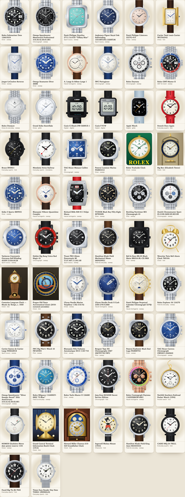
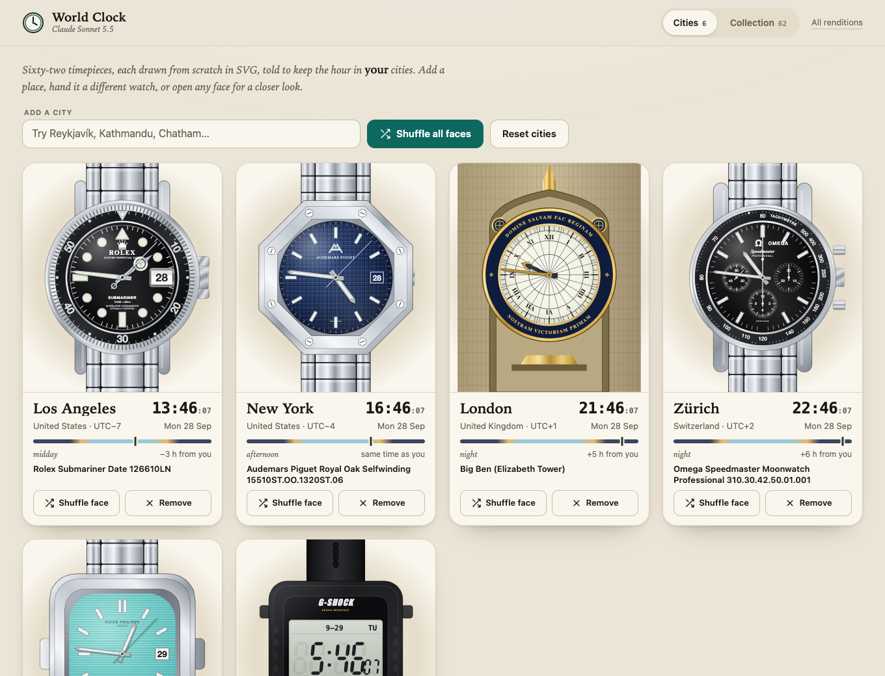

# Claude Sonnet 5.5: reference and rendering notes

This rendition is a new standalone page, [`versions/claude-sonnet-5.5.html`](../versions/claude-sonnet-5.5.html). It was written from scratch for this entry: its own interface, time engine, city atlas, SVG drawing kit and all 62 faces. It does not copy, extend or adapt any other model's page or the active build. No photographs are embedded; every timepiece is drawn as inline SVG when the page loads.

## The page

- **Cities.** The atlas has 134 places. Keyboard search (arrow keys, Enter, Escape) adds a city, and each card can be given a different face or removed. **Shuffle all faces** deals a distinct face to every city and **Reset cities** restores the starting set. Settings are saved in the browser's local storage. Cards are ordered by current UTC offset, west to east, with an alphabetical tie-breaker.
- **Day-part rail.** Each card carries a 24-hour rail with a marker for the local time, a word for the part of the day and the offset from your own zone.
- **Collection and inspection.** The collection can be searched and filtered by kind. Any piece opens in an inspector with its notes and movement, and it can be posed at fixed times (10:08:37, 12:00, 03:15, 06:30, 23:59:50 on 31 December, and 29 February 2028) or handed to any city on the bench. Arrow keys step through the collection.
- **Time.** Local time comes from the browser's `Intl` time-zone data. Each face moves at its catalog cadence:
  - `sweep`: mechanical seconds step at the calibre's beat rate (for example 8 steps a second at 28,800 vph, 6 at 21,600).
  - `tick`: quartz movements and clocks step once a second.
  - `glide`: Spring Drive and the Apple Watch move continuously.
  - `digital`: every LCD segment is drawn and switched individually.
  - `mondaine`: a 58.5-second sweep that pauses at twelve.
  With `prefers-reduced-motion` set, everything but the LCDs steps once a second.
- **Deep links.** `#collection`, `#t=10:08:37&d=2026-09-10` (a fixed pose), `#open=<face>` and `#cities=…&faces=…` are useful for testing and screenshots.

[See the page at phone width](assets/claude-sonnet-5.5-mobile.png)

## References

The supplied photo archive has images for 35 of the 62 catalog objects. For those, the case shape, printing, hands and colours were compared against the photos:

`bigbang`, `bigpilot`, `blackbay58`, `carrera`, `datejust`, `daytona`, `explorer`, `f1`, `freak`, `gmt`, `grandcentral`, `howardmiller`, `jorggray`, `marine`, `mickey`, `milgauss`, `nautilus`, `navitimer`, `nomosmetro`, `orloj`, `overseas`, `patek`, `rainbow`, `richardmille`, `royaloak`, `santos`, `seamaster`, `seiko5`, `snoopy`, `snowflake`, `speedmaster`, `submariner`, `twinbell`, `typexx` and `yachtmaster2`.

The other 27 folders are empty. Those faces were drawn from the catalog entry and general knowledge of the object, without photographs:

`apple`, `bigben`, `bigtic`, `br03`, `braun`, `calatrava`, `casiomq24`, `elprimero`, `f91w`, `fiftyfathoms`, `grandfather`, `gshock`, `khaki`, `kingkhaki`, `lange1`, `monaco`, `mondaine`, `moonphase`, `panerai`, `portugieser`, `prx`, `radiomir`, `railroad`, `reverso`, `swatch`, `tank` and `timexindiglo`.

The Khaki Field King, MQ-24, Big Tic, Easy Reader and Swatch faces are marked as drawn from descriptions in their in-page notes. The railroad watch is drawn from the type rather than one piece, with the company mark simplified to lettering.

## Variant choices

Where the supplied photographs show a different reference from the catalog label, the drawing follows the photographs. The in-page name says which object is drawn.

| Key | Catalog label | Drawn as |
| --- | --- | --- |
| `nautilus` | 5811/1G-001 | 5711/1A-018 “Tiffany Blue”, as in the supplied photographs. |
| `overseas` | 4520V/210A-B128 | The blue-dial Overseas with the round bezel and stepped notches, as photographed. |
| `bigbang` | Big Bang Unico Red Magic 42 | A red-ceramic Big Bang sandwich case with H-screws and a skeleton dial. |
| `marine` | 1182-310/42 | The white-enamel steel Torpilleur with blued hands, as photographed. |
| `freak` | Freak X Carb | The blue-dial Freak X on a blue rubber strap, as photographed. |

## Intentional approximations

- **Chronographs are shown at rest.** Their registers do not run; running seconds and small seconds do.
- **Calendars.** The Patek and Blancpain moon phases follow the mean synodic month. Date, day and month windows read the live date, so month ends and 29 February show correctly.
- **Orloj.** The sun and moon hands, the moon's phase and the eccentric zodiac ring are computed from the date rather than geared. The sky, horizon and hour lines are a stylised rendering of the real astrolabe.
- **Grandfather clocks.** The Comtoise pendulum swings with the seconds; the Howard Miller pendulum and moon arch are static accents apart from the lunar-date scroll.
- **Freak.** The carousel stands in for the minute hand and circles the dial once an hour; the hour arrow is lumed.
- **Rendering.** Metals, ceramic, lacquer, leather, rubber and lume are SVG gradients and patterns. Fine engraving, guilloché and small dial print are simplified so they stay legible at card size, and dial lettering uses the browser's fonts.
- **Sunburst and texture.** Sunburst, waffle, Grande Tapisserie and Snowflake textures are built from repeated strokes rather than photographs.

## Validation

- All 62 faces rendered in headless Chrome at several poses, including 10:08:37, 12:00, 03:15, 06:30, 23:59:50 on 31 December and 29 February 2028. Each was checked for layout, hand geometry and clipping, with no console errors.
- The face list matches the 62-piece catalog, and every face carries the catalog cadence.
- City search, add, remove, single shuffle, shuffle all, reset, reload persistence, sort order, the collection filters and the inspector were exercised in the browser. Desktop (1300 px) and phone (390 px) layouts show no horizontal overflow.
- `npm test` passes.
