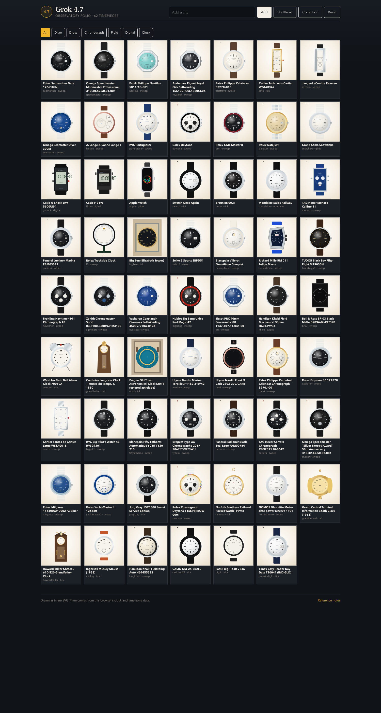
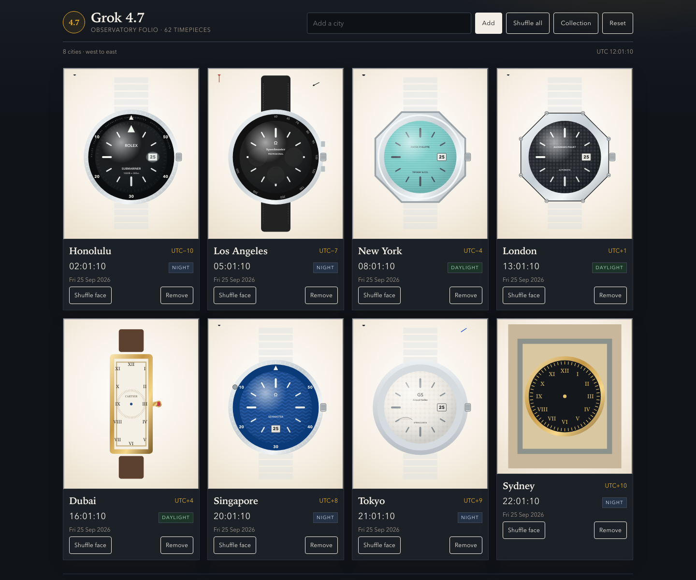

# Grok 4.7: reference and rendering notes

This rendition is a new standalone page, [`versions/grok-4.7.html`](../versions/grok-4.7.html). It was written from scratch for this entry. It has its own observatory interface, time engine, SVG drawing kit, and all 62 faces. It does not copy, extend, or adapt any other model's page, including the earlier Grok 4.5 checkpoint. No photographs are embedded: each timepiece is drawn as inline SVG when the page loads.

## The page

- **Cities.** The atlas has 67 cities. Keyboard search adds cities, and cards can be removed or given a different face. **Shuffle all** re-deals distinct faces while unused faces remain. **Reset** restores the eight starting cities. Settings are saved in the browser's local storage under a Grok 4.7 key. Cards are ordered by current UTC offset, west to east, with an alphabetical tie-break.
- **Sky badge.** Each card shows Daylight, Dawn, Dusk, or Night from a simple solar-elevation estimate at that city's latitude.
- **Collection and inspection.** The collection can be filtered by category. Opening a piece shows its notes, cadence, and movement. It can be posed at 10:10, 12:00, 03:15, 06:30, 23:59, or full moon, and assigned to any city in the folio.
- **Time.** Local time comes from the browser's `Intl` time-zone data. Each face moves at its catalog cadence:
  - `sweep`: seconds step at the calibre's beat rate.
  - `tick`: quartz and clocks step once a second.
  - `glide`: Spring Drive and Apple Watch move continuously.
  - `digital`: LCD segments are drawn and switched.
  - `mondaine`: the seconds hand reaches twelve early and pauses.
- **Moon.** The moon phase follows the mean synodic month.
- **Chronograph.** Start, stop, and reset are available in the inspection view for faces that have a chronograph hand.

[See the page at phone width](assets/grok-4.7-mobile.png)

## References

The supplied photo archive has images for 35 of the 62 catalog objects. Layout, case shape, and dial printing for those faces were checked against the photographs where a folder contained images:

`submariner`, `speedmaster`, `nautilus`, `royaloak`, `seamaster`, `daytona`, `gmt`, `datejust`, `snowflake`, `f1`, `seiko5`, `richardmille`, `blackbay58`, `navitimer`, `overseas`, `bigbang`, `twinbell`, `orloj`, `marine`, `freak`, `patek`, `explorer`, `santos`, `bigpilot`, `typexx`, `carrera`, `snoopy`, `milgauss`, `yachtmaster2`, `jorggray`, `rainbow`, `nomosmetro`, `grandcentral`, `howardmiller`, and `mickey`.

The other 27 folders are empty. Those faces were drawn from the catalog entry and published descriptions of the object:

`calatrava`, `tank`, `reverso`, `lange1`, `portugieser`, `gshock`, `f91w`, `apple`, `swatch`, `braun`, `mondaine`, `monaco`, `panerai`, `bigben`, `moonphase`, `elprimero`, `prx`, `khaki`, `br03`, `grandfather`, `fiftyfathoms`, `radiomir`, `railroad`, `kingkhaki`, `casiomq24`, `bigtic`, and `timexindiglo`.

## Variant choices

Where the supplied photographs show a different object from the catalog label, the drawing follows the photographs. The in-page note says which object is drawn. The catalog name on the card stays the catalog name so the face remains identifiable.

| Key | Catalog label | Drawn as |
| --- | --- | --- |
| `nautilus` | 5811/1G-001 | 5711/1A-018 Tiffany blue, as in the supplied photographs. |
| `freak` | Freak X Carb | Rose-gold bezel Freak from the supplied photographs, not the carbon case. |
| `overseas` | 4520V/210A-B128 | Blue dial with a cross-shaped bezel, following the 4500V photographs. |
| `bigbang` | Big Bang Unico Red Magic 42 | Catalog red ceramic bezel. Several archive photos show the steel 301 instead. |
| `submariner` | 126610LN | Catalog ceramic maxi dial. The clearest archive photo is an aluminum-insert 16610 of the same family. |

## Intentional approximations

- **Character art.** Snoopy and Mickey Mouse are not drawn. The anniversary Speedmaster keeps a 50 mark. The 1933 Ingersoll is a round chrome watch with yellow-tipped hands and a starred seconds disc.
- **Power reserves** are illustrative. The browser cannot know a mainspring's state. Lange 1, Snowflake, and NOMOS Metro use a fixed or daily cycle.
- **Regatta countdown.** The Yacht-Master II hand runs without stopping and starts again every ten minutes.
- **Chronographs** rest until started in the inspection view.
- **Activity rings** on the Apple Watch are a fixed illustration, not live health data.
- **INDIGLO.** On the Timex Easy Reader, the blue-green glow appears between 20:00 and 06:00 local. On the real watch it lights when the crown is pressed.
- **Astronomical displays.** The Prague Orloj's zodiac and day/night sector are computed from the date, not geared. Side figures are blocks, not copied statues.
- **Grand Central side dials** are foreshortened and keep the same time as the front dial.
- **Railroad emblem.** The Norfolk Southern mark is an NS monogram, not a copied logo.
- **Rendering.** Metal, ceramic, lacquer, leather, lume, and glass are SVG gradients and patterns. Fine engraving and some small dial printing are simplified so they stay legible at card size.

## Validation

- The page renders in headless Chrome with eight starting cities, live offsets ordered west to east, and no boot error.
- Face keys and cadences match the 62-entry catalog.
- `npm test` passes.
